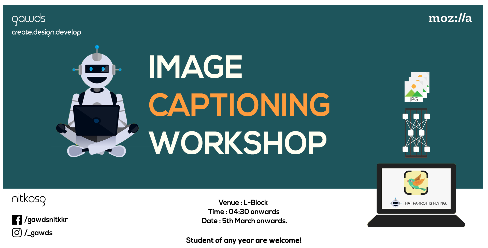

# Image-Captioning-Workshop
*in National Institute of Technology, Kurukshetra*

This Repository contains the resources for the Image Captioning workshop conducted by GAWDS

## Contents:
1. [Neural Network Basics](nn_basics/)
2. [Intro to CNN](CNN/)
3. [Intro to RNN](RNN/)
4. [Image Captioning Project](image-captioning)
